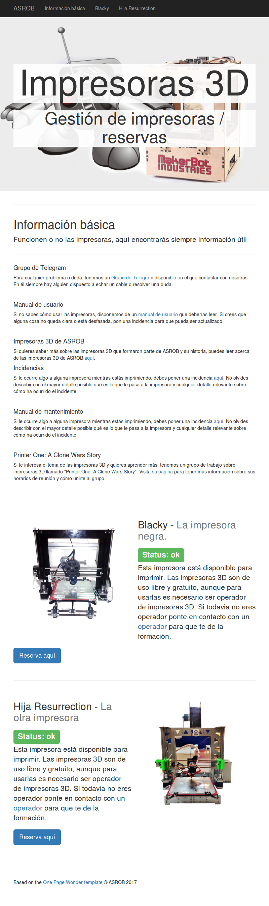
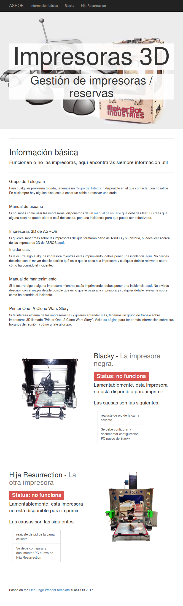

Printers Status Page
------------

Automatic generation of printers status page based on [Jinja2](http://jinja.pocoo.org/docs/2.9/) templates and [GitHub issues](https://github.com/asrob-uc3m/impresoras-asrob/issues/).

Author: [David-Estevez](https://github.com/David-Estevez)

# Usage

1. Install dependencies: `pip install -r requirements.txt`.
2. Copy the `website` folder to the corresponding directory in your website server.
3. Run the generate script with the path of the index.html file to write: `python generate.py -o path/to/website/index.html`.

You will have to schedule the execution of generate.py in order to have an updated webpage. 

# Screenshots

# Attributions

* [Bootstrap](http://getbootstrap.com/).
* Based on the Based on the [One Page Wonder template](http://startbootstrap.com/template-overviews/one-page-wonder/).
